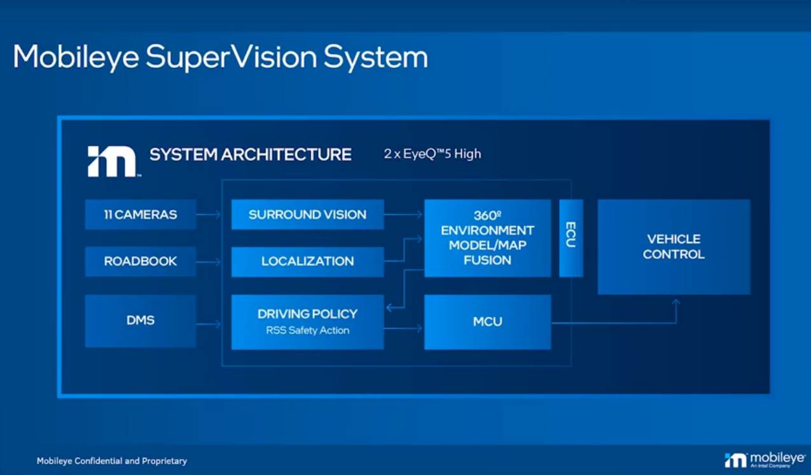

#! https://zhuanlan.zhihu.com/p/464644203

# Mobileye Planning Methods for Zeekr001

> Prof. Shai Shalev-Shwartz 是 ME 的 CTO ，本身是 Online Learning 的专家，算是 AI 领域的理论派，也是 [Understanding Machine Learning: From Theory to Algorithms](https://www.cs.huji.ac.il/w~shais/UnderstandingMachineLearning/index.html) 一书的作者，他的很多观点是比较高屋建瓴值得深思的。此处为他的一个 [Talk](https://www.youtube.com/watch?v=ViGL0z1BULs) 

## 背景

ME 和极氪合作的 001 车型的系统架构分享，其中采用的芯片为 EyeQ 5 

ME 的策略特点是强依赖于摄像头（**个人觉得，参考线等信息必须要依赖于摄像头，通过融合定位得到的高精地图给出的道线是不能长期信赖的**）

## Driving Policy

从 ME 的架构划分中可以看出，**Decision 和 Planning 本身是高度耦合的，互相补充的**，这和很多现有架构中将其拆分开来的做法不同。

Driving Policy 我个人的理解是考虑了规划器的决策，其输出是可以直接给 Control 层的

### Driving Policy 的难点

+ 很难有一个可以参照的绝对基准
+ 现在的决策可能会产生长远影响（**非马尔可夫**）
+ 闭环——可能比较准确的应该理解为**博弈**
+ 对于不确定性的考虑

这里开始讲比较具体的困难:

第一个困难是由于不确定性，以及所感知的范围有限度，需要规划足够长的时间

 

但是实际上如果进行足够长时间的规划，就**必须对于其他 agent 对于本车的行为可能的反应** 进行预测，这其实是一个博弈的过程。

实际上所能采取的规划策略有以下几种：

+ 蛮力搜索：过于费时，显然不可行
+ MCTS 
+ 基于动态规划的方法
+ 端到端

下面分别进行介绍：

 

MCTS 的主要优势在于可以通过蒙特卡洛模拟来降低蛮力搜索的复杂度，并且其可以考虑其他参与者对于本车的反应。显然算法的准确性很大程度上依赖于其他参与者的模型，而且这样的搜索不是完备的……

对于动态规划算法而言，则不对其他参与者的行为进行建模而只是构建单一的响应从而构建 MDP ，这大大的减缩了搜索空间（其实这也是目前实际在用的规划算法的主体思想，比如 Apollo 中将速度和轨迹解耦）

 

## ME 的 Method

接下来是重头戏

 

 

其实关键的地方几乎啥都没说，后面就开始扯 RSS 模型我就没继续笔记了

从有限的几句话中大概可以推测其策略：

+ 考虑最为糟糕的情况——这样其实需要考虑的情况也非常多？
+ 对于其他 agents 给出 intention 的预测而不是一般地给出其未来轨迹的预测（此处明确说是用深度学习），可以推测后续的决策模型应该也是基于学习的

