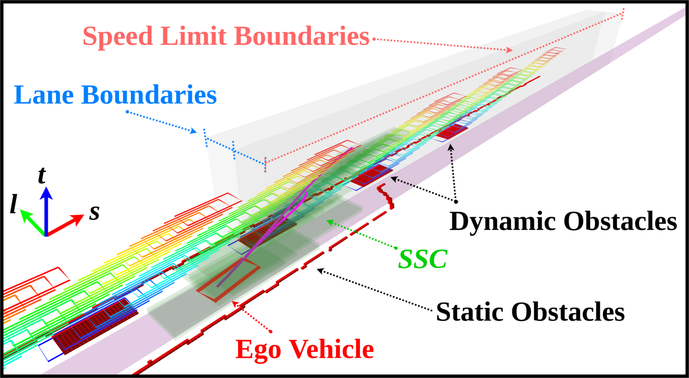

# [实时路径规划]论文分享：Safe Trajectory Generation for Complex Urban Environments Using Spatio-temporal Semantic Corridor

> Paper: [Safe Trajectory Generation for Complex Urban Environments Using Spatio-temporal Semantic Corridor](https://arxiv.org/html/1906.09788#:~:text=%5B1906.09788%5D%20Safe%20Trajectory%20Generation%20for%20Complex%20Urban%20Environments,as%20dynamic%20agents%2C%20traffic%20lights%20and%20speed%20limits%29)
>
> Code: [Spatio-temporal Semantic Corridor](https://github.com/HKUST-Aerial-Robotics/spatiotemporal_semantic_corridor)

## Intro

首先列举目前的 Planning 问题的难点： 

*Planning safe trajectories for autonomous vehicles in complex urban environments is challenging since there are numerous semantic elements (such as dynamic agents, traffic lights and speed limits) to consider. These semantic elements may have different mathematical descriptions such as obstacle, constraint and cost. It is non-trivial to tune the effects from different combinations of semantic elements for a stable and generalizable behavior.*

着重指出对于障碍物的考虑十分复杂，需要对于不同语义种类的（如动态障碍物、交通灯、限速）加以考虑

现有的很多方法是在**离散的点上施加约束，但是点和点中间是否产生不可行轨迹就无从得知** 

*motion planners try to check or enforce constraints at a series of sampled points. However, these methods may fail to detect or resolve infeasible points between two sample points, and thus cannot provide safety guarantee for the entire trajectory.*

基于这样一个想法——绝大多数的 semantic elements 要么可以被表达为时空障碍物或者时空约束 提出了 spatio-temporal semantic corridor(SCC) 这样的一个方法：

*The SSC is motivated by the fact that most semantic elements can be either rendered as spatio-temporal obstacles or constraints within a certain range of the spatio-temporal domain. The key feature of the SSC is its abstraction for different types of semantic elements. Essentially, the SSC consists of a series of mutually connected collision-free cubes with dynamical constraints posed by the semantic elements. We propose an SSC generation process to generate and split the cubes so that the dynamical constraints can be correctly associated.*

###  *Spatio-temporal motion planning for AVs*

Due to an unacceptable blowup in the size of the search space (i.e., the *curse of dimensionality*), GPU-accelerated dynamic programming is adopted in [[6](https://ar5iv.org/html/1906.09788#bib.bib6)]. However, the semantic elements in urban environments (such as speed limits, traffic lights, etc.) are not modeled in [[5](https://ar5iv.org/html/1906.09788#bib.bib5), [6](https://ar5iv.org/html/1906.09788#bib.bib6), [8](https://ar5iv.org/html/1906.09788#bib.bib8)].

### *Corridor generation for AVs*

The spatial corridor (i.e., convex free-space) is widely applied in trajectory generation. Zhu *et al.* [[11](https://ar5iv.org/html/1906.09788#bib.bib11)] propose a convex elastic smoothing algorithm, which can generate a collision-free “tube” around the initial path and formulate the trajectory smoothing problem into a quadratically constrained quadratic programming (QCQP). Erlien *et al.* [[12](https://ar5iv.org/html/1906.09788#bib.bib12)] consider not only spatial information but also vehicle dynamics to construct the convex tube. Both of these works, however, generate the corridor in a static environment and cannot deal with dynamic obstacles. Liu *et al.* [[13](https://ar5iv.org/html/1906.09788#bib.bib13)] find a convex feasible set around the reference trajectory and leverage the convex feasible set to accelerate the non-convex optimization. However, the computation complexity is still prohibitively high for real-time applications. Moreover, collision-avoidance is their major concern and semantic elements are not considered. We are motivated by these corridor generation methods and further extend the spatial corridor to the spatio-temporal domain to cope with dynamic obstacles. Additionally, the proposed SSC can take various kinds of semantic elements into account.

## Work Content

### System overview

框架可以被分为四部分：

+ 环境理解模块（基于语义地图）：The first phase is the environment understanding obtained by a semantic map manager which takes the responsibility to manage the semantic elements (e.g., occupancy grid map, dynamic agents, lanes, traffic rules, etc.) for local planning purposes.
+ 预测模块：The second phase is the prediction, which not only provides high-level behavior anticipations (e.g., lane change, lane keeping, etc.) but also predicted trajectories for other dynamic agents. 
+ 决策模块（注意和规划强耦合）：The third phase is the behavior planning, which is implemented using the multi-policy decision making (MPDM) method, as elaborated in Sect. [IV](https://ar5iv.org/html/1906.09788#S4). 
+ 规划模块：The fourth phase is our proposed motion planning, which takes discretized future simulated states from the behavior planner as seeds for corridor generation. Note that our trajectory generation framework can also work with other behavior planners, such as those in [[10](https://ar5iv.org/html/1906.09788#bib.bib10), [14](https://ar5iv.org/html/1906.09788#bib.bib14), [15](https://ar5iv.org/html/1906.09788#bib.bib15)], as long as the behavior planner provides a preliminary initial guess about the future states.

To construct the SSC, four ingredients are needed, namely, a semantic map which consists of the semantic elements, predicted trajectories for dynamical agents, forward simulated states, and a reference lane given by the route information. Note that the trajectory prediction module may be optional if the forward simulated states already include the states for other agents such as the case of MPDM. In such case, we can use the simulated states of other vehicles as the predicted trajectories, which facilitates passing interaction anticipations from behavior planning to motion planning layer. However, since this is not a common feature in behavior planning, we still use the predicted trajectories from the trajectory prediction module in the experiments for generality, which may lose the interaction information from behavior planning. To summarize, the source of the seeds and the modeling of interaction depend on the choice of behavior planner. （这一工作并未考虑 interaction 所以其实用的是预测轨迹，这一点在作者最新的文章 EPSILON 中有所改进）

### Preliminaries on Multi-policy Decision Making

> 虽然不是这篇文章的主要内容但是需要进一步加深理解的一个方法（所谓决策规划不分家）

The MPDM model formulates the behavior planning problem as a general multi-agent partially observable Markov decision process (POMDP) to model the interaction and uncertainty in dynamic environments. Since solving the POMDP quickly becomes computationally intractable when the number of vehicles increases, MPDM relaxes the problem and assumes that both our vehicle and the other agents are executing a finite set of closed-loop discrete policies (e.g., lane change, lane keeping, etc.). Moreover, for each closed-loop policy, the future situation is anticipated via forward simulating all the vehicle states using a simplified simulation model, such as an idealized steering and speed controller. A comprehensive reward function is designed to assess the future situation and the best behavior is elected.

Since MPDM provides the forward simulated states for multiple behaviors (e.g., lane change left, lane change right, and lane keeping) at the same time, **we fully utilize this feature and generate candidate trajectories for all the potential behaviors to enhance the robustness of the framework. For example, while executing a lane change trajectory, our trajectory framework always prepares the trajectory for switching back to the original lane**, as shown in Fig. [3](https://ar5iv.org/html/1906.09788#S2.F3).

Note: **注意到决策层是给出多种可能的意图，因而规划会产生多条待选轨迹（有一些类似于在换道时总是规划换回原来车道）**

### Spatio-temporal Semantic Corridor

> 论文的核心方法

采用 $s-l-t$ 的 3D frenet 网格

*Rather than generating the corridor in Cartesian coordinates, we adopt the Frenét frame representation since most of the semantic elements are associated with the lane geometry. For example, speed limits, traffic lights and stop signs are typically associated with a certain longitudinal range of a lane. Moreover, since human-like driving behavior can typically be decoupled into lateral movements and longitudinal movements, modeling the free-space in these two directions is a more natural representation than modeling free-space in Cartesian coordinates. Time is another necessary dimension since many semantic elements are time-indexed. For instance, the predicted trajectory is time-profiled and can be regarded as a series of spatio-temporal obstacles.*

主要分为 bstacle-like and constraint-like semantic elements 两种约束

### Obstacle-like semantic elements

主要针对有明确语义的障碍物或者约束

*Many semantic elements have the physical meaning that a certain portion of the 𝑠𝑙𝑡sltitalic_s italic_l italic_t domain is not allowed to be driven in. For example, static obstacles can be viewed as obstacles across whole time axes, and dynamic obstacles can be viewed as a series of static obstacles in the time domain according to the predicted trajectory, while a red light can be rendered as an obstacle occupying a particular longitudinal position and time period. After rendering obstacle-like semantic elements to the 𝑠𝑙𝑡sltitalic_s italic_l italic_t domain, the configuration space is a 3-D occupancy grid.*

### Constraint-like semantic elements

顾名思义对于某些状态变量直接或者间接的约束

*Apart from the obstacle-like semantic elements, many semantic elements represent dynamical constraints or time constraints. For example, speed limits and stop signs can be viewed as velocity constraints. There are also semantic elements which pose time constraints. For instance, when crossing lanes, the total time of the lane change should not be unreasonably long.*

对于 constraint-like semantic elements 采用统一描述 *semantic boundaries*

For instance, a speed limit can be regarded as the velocity constraint applied to a longitudinal range $[s_{begin},s_{end}]$ ,where $s_{begin}$ and $s_{end}$ are two semantic boundaries. The lane change duration constraint can be regarded as a time constraint applied to the lateral range $[d_{\text{begin}},d_{\text{end}}]$ of the current lane. Essentially, the semantic boundaries represent where a certain semantic element starts and stops taking effect.

同时也需要考虑约束的“软硬程度”（是否可以一定程度 violate）

*Note that there is a minor difference in terms of the “hardness” of the constraints. Specifically, the constraints posed by traffic rules (e.g., speed limit) are hard constraints which should be followed without any compromise. Other constraints (e.g., lane change duration constraint) are required for a natural human-like behavior and there is no universal quantitative description of such constraints. We take the difference into account during the corridor generation process (Sect. [V](https://ar5iv.org/html/1906.09788#S5)).*

###  *Semantic Corridor Generation*

算法框架

As outlined in Algo. [1](https://ar5iv.org/html/1906.09788#algorithm1), the generation process consists of seed generation (Line 3), cube inflation (Line 4), constraint association (Line 5) and cube relaxation (Line 6).

#### Seed Generation

初始无碰撞的状态：

*The seeds of the semantic corridor are generated by projecting the forward simulated states of the behavior planner to the 𝑠𝑙𝑡sltitalic_s italic_l italic_t configuration space. Since the forward simulated states are discretized, the feasibility of the corridor generation process depends on the complexity of environments and seed resolution. To guarantee the success of the corridor generation process, we require the initial cubes constructed from consecutive seeds to be collision-free*

#### Cube Inflation with Semantic Boundaries

The corridor is generated by iterating over the seeds. The seeds which are already contained in the last inflated cube are skipped (Line 4, Algo. [2](https://ar5iv.org/html/1906.09788#algorithm2)) since they are topologically equivalent. The initial cubes are generated based on two consecutive seeds, by regarding the two seeds as two cube vertices (Line 5, Algo. [2](https://ar5iv.org/html/1906.09788#algorithm2)).

核心是对于 semantic boundaries 的考虑

The goal of the cube inflation process is to generate cubes which match the semantic boundaries so that the constraints can be conveniently associated. Specifically, when the initial cube intersects with a certain semantic boundary, the inflation direction opposite to the entry direction is disabled, so that the inflated cube can almost match the semantic boundaries. The inflation alternates among three 𝑠𝑙𝑡sltitalic_s italic_l italic_t directions for one step of inflation and terminates if this step collides with an obstacle or intersects with a certain semantic boundary. A toy example is provided in Fig. [4](https://ar5iv.org/html/1906.09788#S4.F4) (b) and (c). Since in the optimization (Sect. [VI](https://ar5iv.org/html/1906.09788#S6)) each cube corresponds to one piece of the trajectory and to preserve convexity we do not explicitly optimize the durations of the pieces, the time upper bound of the current cube should coincide with the time lower bound of the next cube. One may consider optimizing the durations (which is non-convex) and in such case, a further inflation to increase overlapping in the $t$ dimension can be beneficial.

#### Cube Relaxation

After the cube inflation process, the inflated cubes almost match the semantic boundaries, as shown in Fig. [4](https://ar5iv.org/html/1906.09788#S4.F4) (c). However, as mentioned in [V-A2](https://ar5iv.org/html/1906.09788#S5.SS1.SSS2), some constraints, such as the lane change duration constraint, are soft and extra space should be left for optimization. To this end, we adopt a cube relaxation process to relax the cube boundaries while preserving the hard constraints and collision-free property, as shown in Fig. [4](https://ar5iv.org/html/1906.09788#S4.F4) (d). The maximum margin allowed for the relaxation is systematically determined by the constraints applied to the two consecutive cubes. For example, in the longitudinal direction, the margin can be dermined by velocity matching distance according to the velocity constraints. For the lateral direction (i.e., the lane change case), the margin can be calculated by the allowed fluctuation of lane change duration.

## Trajectory Generation With Safety and Feasibility Guarantee

> Bezier 曲线在 Convex Corridor 中生成轨迹

Bezier 和 多项式曲线相比的优势：

However, the quintic monomial polynomial is not suitable for the optimization in the SSC for the following two reasons: 1) one segment of the polynomial only has limited representation ability and may fail to represent a highly constrained maneuver required by the SSC, and 2) the monomial basis polynomial is not well suited to problems with complex configuration space obstacles and dynamical constraints. In previous works on monomial basis polynomial trajectories [[18](https://ar5iv.org/html/1906.09788#bib.bib18), [19](https://ar5iv.org/html/1906.09788#bib.bib19)], the constraints are only enforced/checked on a finite set of sampled points. However, this method may fail to detect collision between sample points, and thus cannot provide any guarantee on safety and feasibility.

注意这一方法的轨迹依然是做了 s-l 和 s-t 的解耦

### *Bézier Basis and Its Properties*

A degree $m$ Bézier curve $f(t)$ defined on a fixed interval $t\in[0,1]$ by $m+1$ control points as follows
$$
f(t)=p_{0}b_{m}^{0}(t)+p_{1}b_{m}^{1}(t)+\cdots+p_{m}b_{m}^{m}(t)=\sum_{i=0}^{%
m}p_{i}\cdot b_{m}^{i}(t),
$$
where $p_i$ denotes the control point and $b_{m}^{i}(t)={m\choose i}t^{i}\cdot(1-t)^{m-i}$ is the Bernstein basis. Denote the set of control points $[p_{0},p_{1},\ldots,p_{m}]$ as $P$

+ The *convex hull* property is suitable for the problem of constraining the curve in a convex free-space. Specifically, the Bézier curve $f(t)$ is guaranteed to be entirely confined in the convex hull supported by the control points $P$. In other words, by constraining $P$ inside the convex free-space, the resulting curve is guaranteed to be collision-free.
+ The *hodograph* property facilitates constraining high-order derivatives of the Bézier curve, which is useful for enforcing dynamical constraints. By the hodograph property, the derivative of a Bézier curve $\frac{df(t)}{dt}$  is another Bézier curve with control point $p_{i}^{(1)}=m\cdot(p_{i+1}-p_{i})$. By  applying the convex hull property on the derivative Bézier curve, the entire dynamical profile of the original curve $f(t)$ can be confined within a given dynamical range, as shown in the following Fig.

### *Piecewise Bézier Curve Representation*

The $j$ th  segment of an $n$ segment piecewise Bézier trajectory in one dimension $\sigma\in\{s,l\}$ is given by 
$$
f_{j}^{\sigma}(t)=\begin{cases}\alpha_{1}\cdot\sum_{i=0}^{m}p^{1}_{i}\cdot b_{%
m}^{i}(\frac{t-t_{0}}{\alpha_{1}}),&t\in[t_{0},t_{1}]\\
\alpha_{2}\cdot\sum_{i=0}^{m}p^{2}_{i}\cdot b_{m}^{i}(\frac{t-t_{1}}{\alpha_{2%
}}),&t\in[t_{1},t_{2}]\\
\quad\quad\quad\vdots\quad\quad\quad\quad\,&\quad\vdots\\
\alpha_{n}\cdot\sum_{i=0}^{m}p^{n}_{i}\cdot b_{m}^{i}(\frac{t-t_{n-1}}{\alpha_%
{n}}),&t\in[t_{n-1},t_{n}],\\
\end{cases}
$$
Since the Bézier curve is defined on the fixed interval $[0,1]$, while the trajectory duration for each segment may vary, we introduce a scaling factor $\alpha_j$ for each segment according to its duration, similar to [[20](https://ar5iv.org/html/1906.09788#bib.bib20)].

Similar to [[18](https://ar5iv.org/html/1906.09788#bib.bib18)], we minimize the cost function given by the time integral of the square of the jerk. Specifically, the cost $J_j$ of the $j$ th segment can be written as （这里是最小化 jerk 和最新论文中的 Cost 不一样）
$$
J_{j}=w_{s}\int_{t_{j-1}}^{t_{j}}\left(\frac{d^{3}f^{s}(t)}{dt^{3}}\right)^{2}%
dt+w_{l}\int_{t_{j-1}}^{t_{j}}\left(\frac{d^{3}f^{l}(t)}{dt^{3}}\right)^{2}dt,
$$
where $w_s$ and $w_l$ denote the weight for the control cost of the longitudinal direction and lateral direction, respectively. The objective is simple and invariant given different combinations of semantic elements thanks to the SSC, which allows the formulation to easily adapt to different traffic configurations.

### *Enforcing Safety and Dynamical Constraints*

According to the hodograph property, the $k$ th derivative of the non-scaled Bézier curve $\frac{d^{k}y^{\sigma}_{j}(t)}{dt^{k}}$ is supported by control points $\mathbf{q}^{\sigma,(k)}_{j}$ which can be calculated by induction as follows
$$
q^{\sigma,(0)}_{j,i}=p^{j}_{i},q^{\sigma,(k)}_{j,i}=\frac{m!}{(m-k)!}(q^{%
\sigma,(k-1)}_{j,i+1}-q^{\sigma,(k-1)}_{j,i}).
$$
Based on this property, the $k$ th derivatives at the boundaries of $f^{\sigma}_{j}(t)$ can be expressed as
$$
\frac{d^{k}f^{\sigma}_{j}(t_{j-1})}{dt^{k}}=\alpha_{j}^{1-k}\cdot q^{\sigma,(k%
)}_{j,0},\frac{d^{k}f^{\sigma}_{j}(t_{j})}{dt^{k}}=\alpha_{j}^{1-k}\cdot q^{%
\sigma,(k)}_{j,m},
$$
respectively. Moreover, by further applying the convex hull property, we can constrain the entire derivative profile of  $f^{\sigma}_{j}(t)$ using the following sufficient condition,
$$
\beta_{j,-}^{\sigma,(k)}\!\leq\!\alpha_{j}^{1-k}\cdot q^{\sigma,(k)}_{j,i}\!%
\leq\!\beta_{j,+}^{\sigma,(k)}\!,\forall i\Rightarrow\!\beta_{j,-}^{\sigma,(k)%
}\leq\frac{d^{k}f^{\sigma}_{j}(t)}{dt^{k}}\!\leq\!\beta_{j,+}^{\sigma,(k)}
$$

### Desired state constraints

First of all, the generated trajectory should start from the given initial state $[\sigma^{(0)}_{t_{0}},\sigma^{(1)}_{t_{0}},\sigma^{(2)}_{t_{0}}]$ and terminate at the given goal state $[\sigma^{(0)}_{t_{n}},\sigma^{(1)}_{t_{n}},\sigma^{(2)}_{t_{n}}]$ for $\sigma\in\{s,l\}$ , where $\sigma^{(k)}_{t}$ denotes the $k$ th order derivative at time $t$. Specifically, this requires enforcing equality constraints for the first and last segment as follows,
$$
\frac{d^{k}f^{\sigma}_{0}(t_{0})}{dt^{k}}=\sigma^{(k)}_{t_{0}},\quad\quad\frac
{d^{k}f^{\sigma}_{n}(t_{n})}{dt^{k}}=\sigma^{(k)}_{t_{n}},
$$
where $k =0,1,2$

### Continuity constraints

The generated trajectory should be continuous for all the derivatives up to the $k$ th order at all the connecting points between two consecutive pieces. The continuity constraints between the $j$ th segment and the $j+1$ th segment can be written as
$$
\frac{d^{k}f^{\sigma}_{j}(t_{j})}{dt^{k}}=\frac{d^{k}f^{\sigma}_{j+1}(t_{j})}{%
dt^{k}},
$$
where $k =0,1,2,3$

### Free-space constraints

To guarantee the generated trajectory is collision-free, we constrain each segment of the trajectory within the corresponding cube. The free-space constraint of the $j$ th segment on dimension $\sigma$ can be enforced by using the sufficient condition (last eq in section *Enforcing Safety and Dynamical Constraints*) under *k =0* where $\beta_{j,-}^{\sigma,(0)}$ and $\beta_{j,+}^{\sigma,(0)}$  represent the position bounds on dimension $\sigma$ given by the shape of the cube.

### Dynamical constraints

To comply with the environment semantics and dynamical feasibility constraint, we enforce the constraints on the derivatives of trajectories by using the sufficient condition(last eq in section *Enforcing Safety and Dynamical Constraints*) under *k =1,2*  The physical meaning is that the maximum lateral/longitudinal velocity and acceleration is constrained. Summarizing all the linear equality and inequality constraints, the overall formulation can be written as a QP, which can be solved efficiently using off-the-shelf solvers (such as OOQP).

(Although Eq. [6](https://ar5iv.org/html/1906.09788#S6.E6) is a sufficient condition, in practice we find it does not result in over-conservative behavior, as shown in Sect. [VII](https://ar5iv.org/html/1906.09788#S7). In the case that no feasible solution can be found, the error is fed back to the behavior layer for further reaction.)

Illustration of an unprotected left turn in a busy urban intersection. When the ego vehicle is approaching the intersection, it finds the left turn is not feasible and it reduces speed to wait. Once feasible, the vehicle quickly accelerates to complete the left turn.

## Some useful refs worth diving into

Z. Ajanovic, B. Lacevic, B. Shyrokau, M. Stolz, and M. Horn, “Search-based optimal motion planning for automated driving,” in *Proc. of the IEEE/RSJ Intl. Conf. on Intell. Robots and Syst.*  IEEE, 2018, pp. 4523–4530.

T. Gu, J. Atwood, C. Dong, J. M. Dolan, and J.-W. Lee, “Tunable and stable real-time trajectory planning for urban autonomous driving,” in *2015 IEEE/RSJ International Conference on Intelligent Robots and Systems (IROS)*.  IEEE, 2015, pp. 250–256.

M. T. Wolf and J. W. Burdick, “Artificial potential functions for highway driving with collision avoidance,” in *Proc. of the IEEE Intl. Conf. on Robot. and Autom.*  IEEE, 2008, pp. 3731–3736.

C. Hubmann, M. Aeberhard, and C. Stiller, “A generic driving strategy for urban environments,” in *Proc. of the Intl. Conf. on Intel. Trans. Syst.*  IEEE, 2016, pp. 1010–1016.

E. Galceran, A. G. Cunningham, R. M. Eustice, and E. Olson, “Multipolicy decision-making for autonomous driving via changepoint-based behavior prediction.” in *Proc. of Robot.: Sci. and Syst.*, 2015.

D. Dolgov, S. Thrun, M. Montemerlo, and J. Diebel, “Path planning for autonomous vehicles in unknown semi-structured environments,” *Intl. J. Robot. Research*, vol. 29, no. 5, pp. 485–501, 2010.

F. Gao, W. Wu, Y. Lin, and S. Shen, “Online safe trajectory generation for quadrotors using fast marching method and bernstein basis polynomial,” in *Proc. of the IEEE Intl. Conf. on Robot. and Autom.*  IEEE, 2018, pp. 344–351.

## Comments

总体而言，是少有的真正直面 urban planning 中的复杂环境中复杂障碍物的规划工作， SSC 的建构思路非常值得学习，而这套 “构建 Corridor 求解优化轨迹” 实际上和决策采用了完全相同的架构和思路，因而实际上 behavior planning 和 local planning 越发联系紧密。是值得学习实践的好工作（进一步有其 EPSILON 论文所提出的完整工作，这一工作可以作为这一系列的工作实践的切入点）